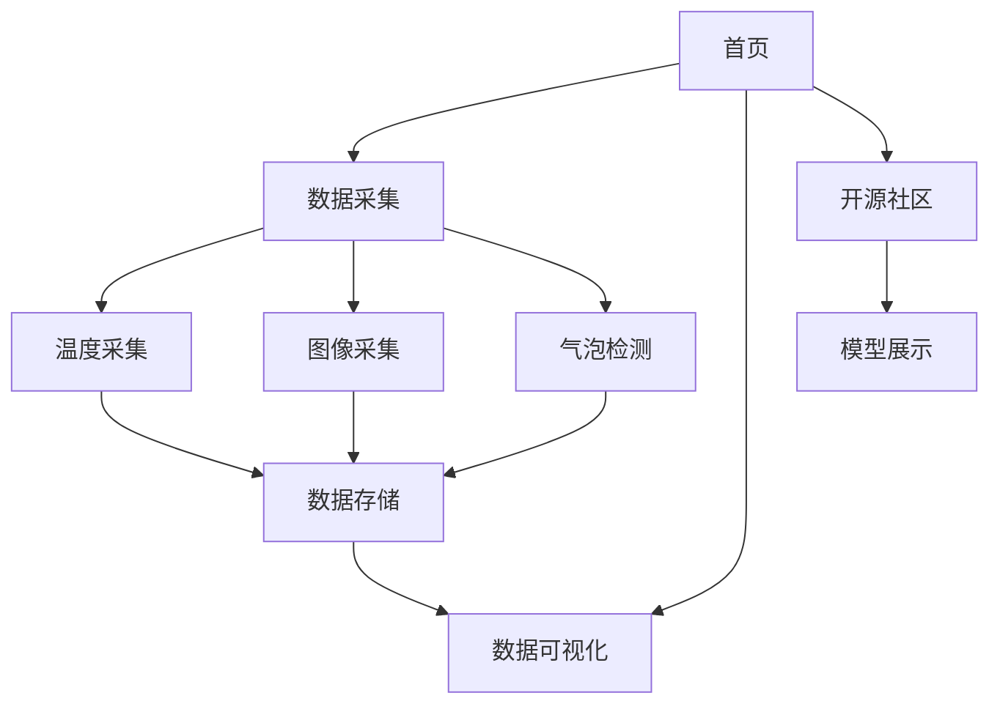

## 1. 产品概述
昆仑哨兵·实验室多模态监控系统是一个专为实验室环境设计的嵌入式多传感器监控系统，部署于Orange Pi Kunpeng Pro开发板。系统通过DS18B20温度传感器、UVC摄像头和NPU模型实现温度监测、图像采集和气泡检测功能，并提供Web可视化界面和开源社区展示。

系统主要解决实验室环境监测的自动化需求，为实验人员提供实时数据采集、历史趋势分析和模型共享平台，提升实验室管理的智能化水平。

## 2. 核心功能

### 2.1 用户角色
| 角色 | 注册方式 | 核心权限 |
|------|----------|----------|
| 访客用户 | 无需注册 | 查看实时数据、历史趋势、开源社区 |
| 实验人员 | 本地访问 | 完整数据访问、图像采集、模型使用 |

### 2.2 功能模块
系统包含以下主要页面：
1. **监控首页**：实时温度显示、图像采集、气泡检测结果、数据可视化图表
2. **开源社区页**：模型展示、下载入口、社区贡献信息

### 2.3 页面详情
| 页面名称 | 模块名称 | 功能描述 |
|-----------|-------------|-------------|
| 监控首页 | 实时数据面板 | 显示当前温度、气泡计数、最新图像缩略图 |
| 监控首页 | 数据采集控制 | 提供温度采集、图像采集、气泡检测按钮 |
| 监控首页 | 数据可视化 | 使用Plotly展示温度趋势图和气泡计数历史 |
| 监控首页 | 系统状态 | 显示各传感器连接状态 |
| 开源社区页 | 社区标题 | 展示"共建多模态实验室生态·昆仑哨兵开源社区"标题 |
| 开源社区页 | 模型展示卡片 | 3-5个模型卡片，包含缩略图、名称、简介、作者、下载按钮 |
| 开源社区页 | 底部号召 | 显示GitHub链接和社区贡献说明 |

## 3. 核心流程

### 数据采集流程
1. 系统启动时自动初始化DS18B20温度传感器和UVC摄像头
2. 用户可通过Web界面手动触发数据采集
3. 温度数据通过读取/sys/bus/w1/devices/28-*/w1_slave获取
4. 图像通过cv2.VideoCapture(0)采集并保存至static/images/
5. 气泡检测使用随机数模拟NPU推理输出
6. 所有数据持久化到openGauss数据库

### 数据展示流程
1. 用户访问首页时加载最新数据
2. 通过/api/latest获取最新传感器数据
3. 通过/api/history获取历史数据用于图表展示
4. 使用Plotly.js渲染温度趋势和气泡计数图表

### 开源社区访问流程
1. 用户点击顶部导航栏"开源社区"Tab
2. 跳转到/community静态页面
3. 展示预定义的模型列表和社区信息

## 4. 用户界面设计

### 4.1 设计风格
- **主色调**：深蓝色(#1e3a8a)搭配白色背景，体现科技感和专业性
- **按钮样式**：圆角矩形，主要操作用蓝色，次要操作用灰色
- **字体**：系统默认字体，标题16px，正文14px
- **布局风格**：卡片式布局，顶部导航栏，主要内容区分左右两栏
- **图标风格**：使用简洁的线性图标，突出功能性

### 4.2 页面设计概览
| 页面名称 | 模块名称 | UI元素 |
|-----------|-------------|-------------|
| 监控首页 | 顶部导航 | 系统标题"昆仑哨兵"，开源社区Tab，当前时间显示 |
| 监控首页 | 左侧数据面板 | 温度卡片(大字体显示25.1°C)、气泡计数卡片、最新图像缩略图 |
| 监控首页 | 右侧图表区域 | 温度趋势折线图(时间轴24小时)、气泡计数柱状图 |
| 监控首页 | 底部控制区 | 三个操作按钮：采集温度、拍摄图像、运行检测 |
| 开源社区页 | 页面头部 | 深蓝色背景，白色标题文字，简洁大气 |
| 开源社区页 | 模型卡片网格 | 3列网格布局，每个卡片包含图片、文字、按钮 |
| 开源社区页 | 底部信息 | 灰色背景，GitHub链接和社区协议说明 |

### 4.3 响应式设计
系统采用桌面优先设计，适配Orange Pi连接的显示器分辨率。在移动设备上保持基本可读性，但主要优化桌面端体验。触摸交互主要针对开发板的触控屏进行优化。