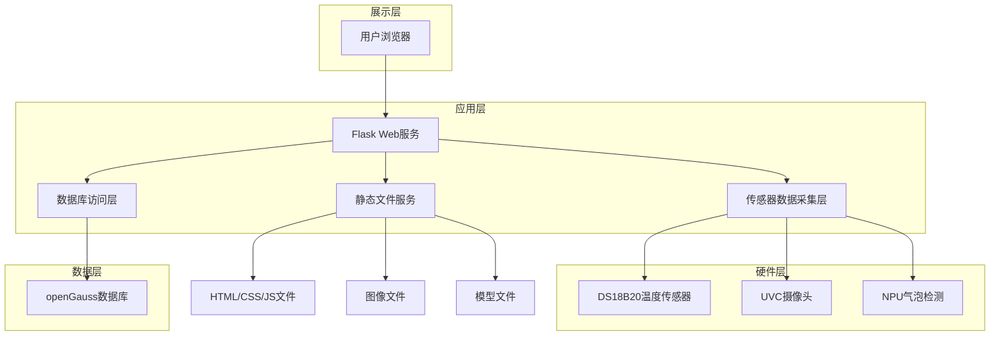
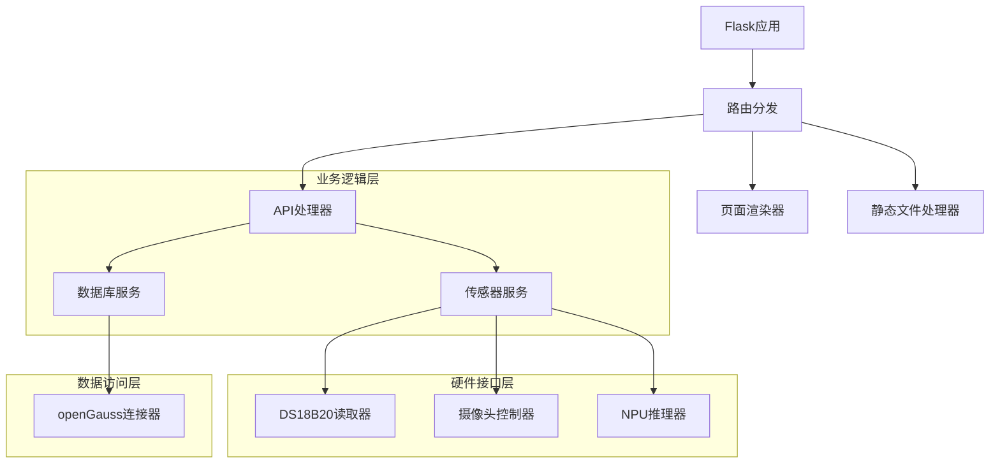
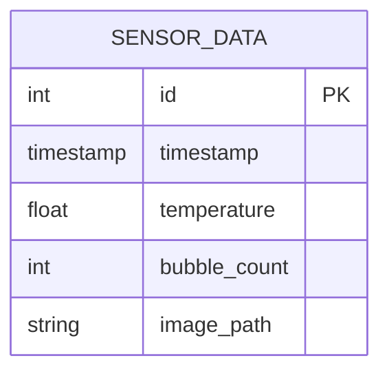

## 1. 架构设计



## 2. 技术描述
- **后端**: Flask@2.3 + Python@3.9
- **数据库**: openGauss@5.0.0 (PostgreSQL兼容)
- **前端**: HTML5 + CSS3 + JavaScript + Plotly.js (CDN)
- **图像处理**: OpenCV-Python@4.8
- **数据库驱动**: psycopg2@2.9
- **传感器接口**: 系统文件读取(/sys/bus/w1/devices/)

## 3. 路由定义
| 路由 | 用途 |
|-------|---------|
| / | 监控首页，显示实时数据和图表 |
| /community | 开源社区静态展示页面 |
| /api/latest | 获取最新传感器数据 |
| /api/history | 获取历史数据用于图表展示 |
| /api/capture | 触发图像采集和气泡检测 |
| /static/<path:filename> | 静态文件服务(CSS/JS/图像) |

## 4. API定义

### 4.1 数据获取API

**获取最新数据**
```
GET /api/latest
```

响应:
```json
{
    "temperature": 25.1,
    "bubble_count": 3,
    "image_path": "/static/images/20240101_120000.jpg",
    "timestamp": "2024-01-01 12:00:00",
    "sensor_status": {
        "ds18b20": "online",
        "camera": "online",
        "npu": "online"
    }
}
```

**获取历史数据**
```
GET /api/history?hours=24
```

响应:
```json
{
    "temperature_data": [
        {"timestamp": "2024-01-01 12:00:00", "value": 25.1},
        {"timestamp": "2024-01-01 12:01:00", "value": 25.2}
    ],
    "bubble_data": [
        {"timestamp": "2024-01-01 12:00:00", "value": 3},
        {"timestamp": "2024-01-01 12:01:00", "value": 2}
    ]
}
```

**触发采集**
```
POST /api/capture
```

响应:
```json
{
    "status": "success",
    "temperature": 25.1,
    "bubble_count": 3,
    "image_path": "/static/images/20240101_120000.jpg"
}
```

错误响应:
```json
{
    "error": "ds18b20 offline"
}
```

## 5. 服务器架构



## 6. 数据模型

### 6.1 数据模型定义


### 6.2 数据定义语言

**传感器数据表**
```sql
-- 创建数据库
CREATE DATABASE lab_monitor;

-- 使用数据库
\c lab_monitor;

-- 创建传感器数据表
CREATE TABLE sensor_data (
    id SERIAL PRIMARY KEY,
    timestamp TIMESTAMPTZ DEFAULT NOW(),
    temperature REAL NOT NULL,
    bubble_count INT NOT NULL,
    image_path TEXT
);

-- 创建索引
CREATE INDEX idx_sensor_timestamp ON sensor_data(timestamp DESC);
CREATE INDEX idx_sensor_temperature ON sensor_data(temperature);

-- 初始化数据（可选）
INSERT INTO sensor_data (temperature, bubble_count, image_path) 
VALUES (25.0, 0, '/static/images/default.jpg');
```

**数据库连接配置**
```python
DB_CONFIG = {
    'host': 'localhost',
    'port': 15400,
    'database': 'lab_monitor',
    'user': 'labuser',
    'password': 'Lab@123'
}
```

## 7. 文件结构
```
/home/openEuler/lab_monitor/
├── app.py                  # Flask主应用
├── static/
│   ├── css/
│   │   └── style.css      # 样式文件
│   ├── js/
│   │   └── main.js        # 前端JavaScript
│   └── images/            # 图像存储目录
├── templates/
│   ├── index.html         # 监控首页
│   └── community.html     # 开源社区页面
├── model/
│   └── bubble_detector.om # NPU模型文件
├── db_init.sql            # 数据库初始化脚本
└── README.md              # 项目说明文档
```

## 8. 部署约束
- 所有路径必须使用绝对路径 `/home/openEuler/lab_monitor/`
- 仅使用预装包：flask, opencv-python, numpy, psycopg2
- 错误处理必须返回 `{"error": "xxx offline"}` 格式
- 静态文件通过Flask的 `/static/` 路由提供
- 数据库连接使用psycopg2，不得使用ORM